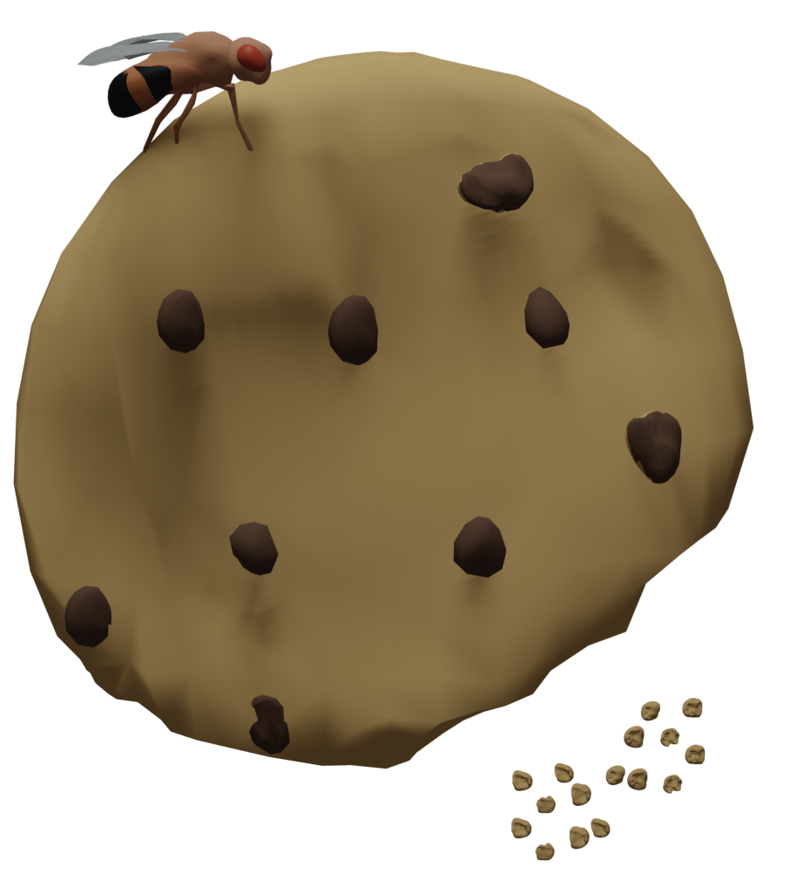
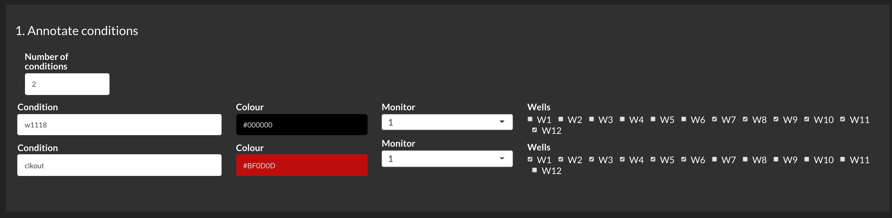
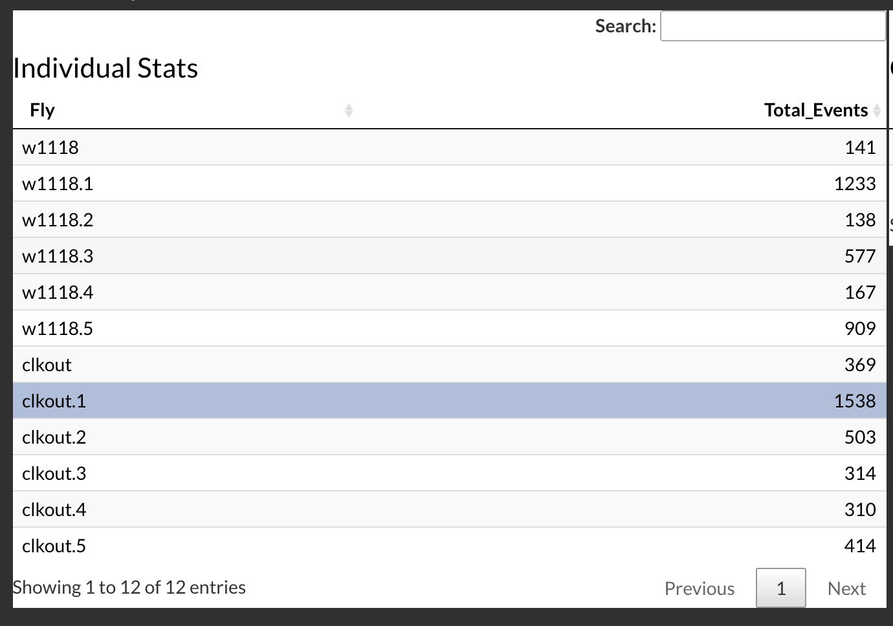

#    <font size="120pt"> CRUMB </font>


## Circadian Rhythm Using Mealtime Behavior
[](https://zenodo.org/badge/latestdoi/612891674)


### Version 1.0

CRUMB is a shiny-based app to analyze data from the FLIC (Fly Liquid-Food Interaction Counter) system. This app optimizes running time and offers a unified pipeline to conduct circadian analysis of the feeding events. CRUMB uses the original code from the Pletcher lab (<https://github.com/PletcherLab/FLIC_R_Code>) as a backbone and provides a user-friendly, interactive, graphical interface powered by the packages `DT` and `plotly`.

## Dependency

* R (version 4.0.3)
* Packages:  
  * "shinyTime", "shinythemes", "shinyWidgets", "shinyjs", "data.table", "dplyr", "reshape2", "ggplot2",     "plotly", "zeitgebr", "purrr", "lubridate", "tibbletime", "colourpicker", "ggpubr", "baseline", "DT",   "accelerometry"

## Install and quick start


### Installation 
To install CRUMB, clone the repository from GitHub using the following code:

```
git clone https://github.com/ClockLabX/CRUMB
```

### Quick Start (Example data)

To start, run the `app.R` script from the main folder. If there are any missing packages, an option to download and install them will be displayed. 

In the **File loading and QC** tab, browse and select the files from the FLIC monitors. For long experiments, each file contains the information of a full day of recording. **Files from different monitors can be loaded at the same time on CRUMB**. Example data contained inside the folder **Examples** correspond to files from monitor 1 (DFM_**1**) across 7 days of recordings. Wells from 1 to 6 correspond to clock mutant *clkout* and the wells 7 to 12 correspond to the control genotype *w1118*. Click **Cache Data & Populate** to engage the files and get dates of recordings. In the **File loading and QC** tab you can also select the parameters to baseline the data, which helps to get rid of artifacts derived from overfilling the wells with food, for instance. 


In the **Initial Survey**, annotate the conditions selecting name, color, and wells corresponding to each experimental condition. **Note** the **Monitor** field is going to be updated by taking the names of the DFM files, thus **do not change the names of the files as they come from the monitors**. Considering the setup of the example, the annotation should look like this: 

 


Use the **Select threshold for feeding events** panel to adjust the parameters for the detection of feeding events. The provided image can give some guidance to understand the parameters. This process can be highly dependent on the experimental conditions thus several iterations are suggested to get the best results. If further information is required to understand this, we suggest to read the original code from the Pletcher lab (<https://github.com/PletcherLab/FLIC_R_Code>). 

From the resulting tables, the **Individual Stats** table shows the value of feeding for each fly starting from Condition to Condition_X. Next to this table, the **Group Stats** table shows the mean, SD, and SEM from the groups specified in the annotation. From the **Individual Stats** table, you can select the outlier to exclude from the rest of the analyses as shown here:

 

The **Feeding Analysis** and the **Circadian Analysis** tab allow the retrieval of information from the feeding events, considering times and dates. Analyses on those tabs rely on the information from the previous tabs, so if you want to exclude any well, monitor or condition, go back and select them from the **Initial Survey** tab.


## Features


### Loading data and setting baseline

No pre-processing is needed; raw CSV data from the FLIC system can be used directly. Some parameters for setting the baseline include:

-   Baseline function (Running Median or Asymmetric Least Squares)

-   Baseline window (for Running Median)

-   Binning function (Sum, Mean)

-   Binning time (1 min, 30 min, 1 hour)

### Extracting feeding events

CRUMB uses the baselined data to calculate the number of feeding events. We used the functions from the FLIC-R-Code to ensure compatibility with previous analysis but to reduce computing time we dropped some calculations including the number of licks and the duration of events. Some other key features of this app include:

-   Grouping of conditions by monitor and/or wells

-   Normalization of the feeding events across time

-   Easy removal of outliers or dead flies by selecting flies from the 'Individual Stats' table

### Daily feeding events

The data can be analyzed in daily bins when values from day and night are provided. This allows the comparison in the number of events during the daytime and during the nighttime.

### Circadian analysis

If data for several days is provided, autocorrelation analysis can be performed across days to assess rhythmicity. Users can select the days conducted on constant darkness to perform this analysis using the date selection. The shell of this tab can be expanded in future versions to include other popular rhythmicity analysis incluing Chi square and Lomb-Scargle.

## Troubleshooting


CRUMB is an open-access app. If you want to contribute to its development, feel free to submit a pull-request. For any question regarding the use of this app and troubleshooting, please email [Sergio Hidalgo](mailto:shidalgo@ucdavis.edu).
